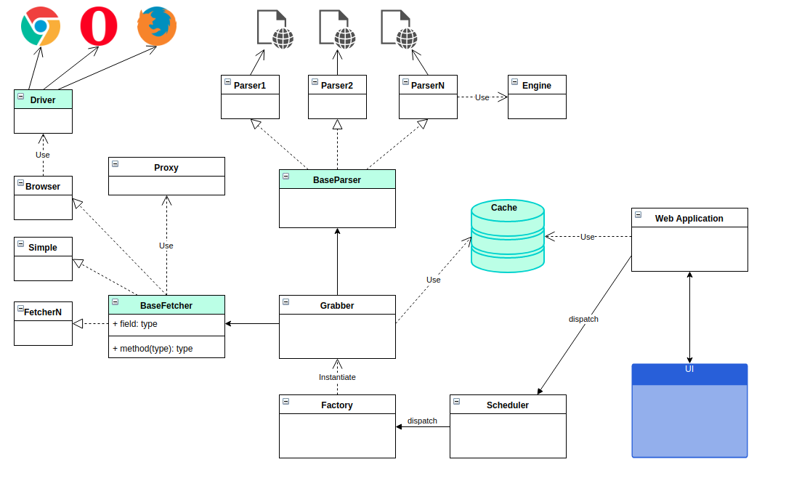
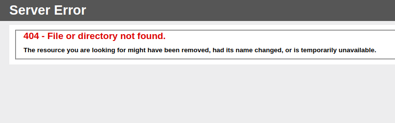

### Implementations details
The diagram below shows the overview for the application design in
general and shows relations between its main components.

#### Factory
Based on resources config file creates instances of grabbers that
will be responsible of handling particular resources. For each
resource instantiate all the needed classes to process one.

#### Grabber
An object corresponding to the resource. Holds all the components
needed to properly grab desired data from a remote resource.

#### Scheduler
Responsible for invoking grabbers for all resources within given
intervals or manually. Behaves as a supervisor to correctly invoke
and cleanup set of grabbers.
 

### Things to improve
* bet365 was not working at the moment of writing, so it can be added as well

* Add dumping data to a file
* Add websockets support to UI for realtime updates
* Add cache invalidation
* Discover available browser drivers automatically
* 100% unittests coverage
